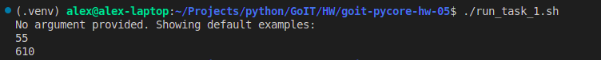
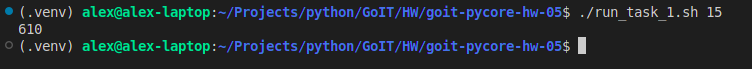
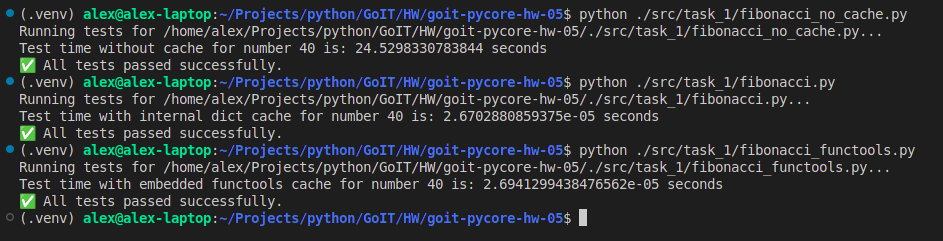
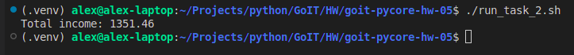
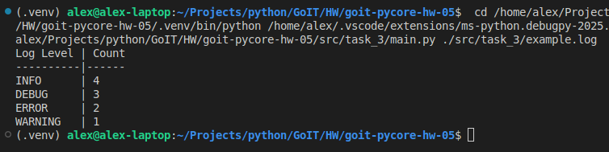
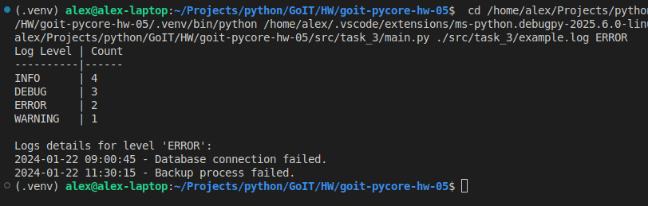
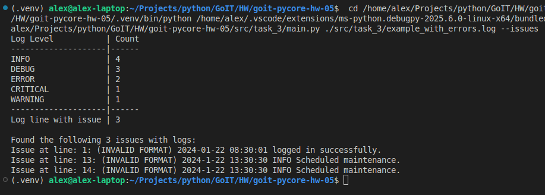
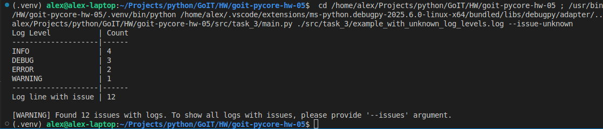
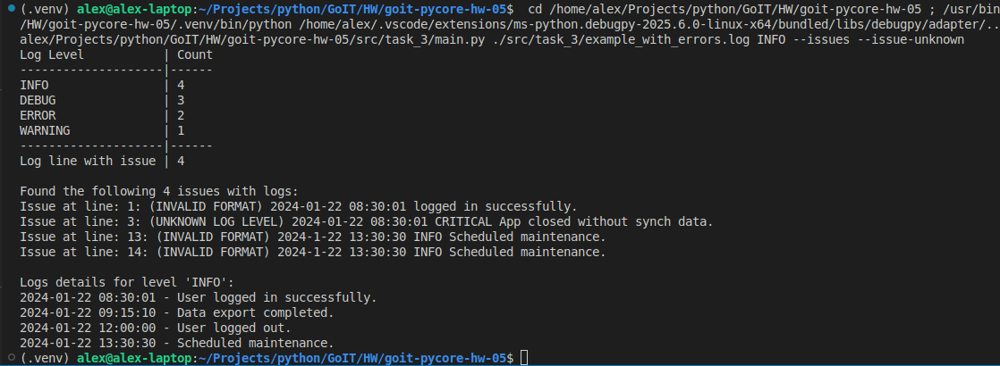
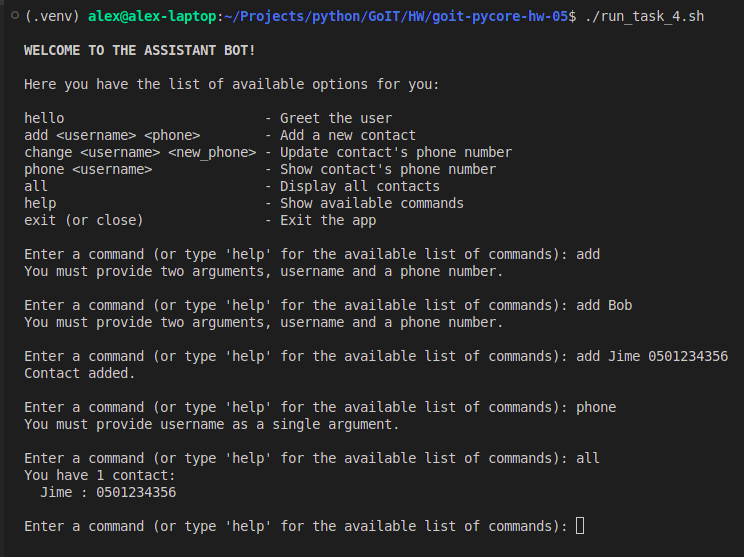

# Python Programming: Foundations and Best Practices 2.0

### [# goit-pycore-hw-05](https://github.com/topics/goit-pycore-hw-05)

<p align="center">
  
</p>


## Python embedded modules and functional programming

This assignment consists of 4 parts in total, each specified separately and has a link to the solution file.

<details>

<summary><h3 style="display: inline-block">Project Setup & Run Instructions</h3></summary>

##### Table of Contents
- [Prerequisites](#setup-prerequisites)
- [Setting Up the Development Environment](#setup-setting-up-environment)
  - [Clone the Repository](#setup-clone-repository)
  - [Create a Virtual Environment](#setup-create-virtual-environment)
- [Running the Project](#setup-running-the-project)
  - [Running the Tasks in VS Code](#setup-running-vs-code)
  - [Running the Tasks from the Command Line](#setup-running-command-line)
  - [Running Tasks with Scripts](#setup-running-script)

#### <a name="setup-prerequisites"></a>Prerequisites

Before starting, ensure that you have the following installed:

* [Python 3.7+](https://www.python.org/downloads/) (Make sure python (`python --version` or `python3 --version`) and pip (`python -m pip --version` or `python3 -m pip --version`) are available in your terminal)
* [Git](https://git-scm.com/downloads) (optional, for version control)

#### <a name="setup-setting-up-environment"></a>Setting Up the Development Environment

1. **<a name="setup-clone-repository"></a>Clone (or copy) the Repository**

    If you haven't cloned the project yet, you can do so using:

    ```bash
    git clone https://github.com/oleksandr-romashko/goit-pycore-hw-05.git
    cd goit-pycore-hw-05
    ```

    or download zip archive with code directly [from the repository](https://github.com/oleksandr-romashko/goit-pycore-hw-04/archive/refs/heads/main.zip).

2. **<a name="setup-create-virtual-environment"></a>Create a Virtual Environment**

    * **Linux/macOS (using `bash` or `zsh`):**

      Run the setup.sh script:

      ```bash
      source setup.sh
      ```

      This will:
      * Create a virtual environment (`.venv`).
      * Activate the virtual environment.
      * Install dependencies listed in `requirements.txt`.
      * Set the `PYTHONPATH` for module imports.

    * **Windows (using Command Prompt):**

      If you're using Command Prompt to set up your development environment, you can run the `setup.bat` script:

      ```cmd
      setup.bat
      ```
      This will:
      * Create a virtual environment (.venv).
      * Activate the virtual environment.
      * Install dependencies listed in requirements.txt.
      * Set the `PYTHONPATH` for module imports.


#### <a name="setup-running-the-project"></a>Running the Project

Once your virtual environment is set up, you can run task code.

* **<a name="setup-running-vs-code"></a>Running the Tasks in VS Code**

  Once the virtual environment is activated and `PYTHONPATH` is set, you can run each of the task files directly from VS Code. Make sure that your `settings.json` (in `.vscode` folder) is correctly set up, as discussed previously.

  VS Code will automatically use the virtual environment and set the correct `PYTHONPATH` if you've configured your settings properly.

  You can launch each task with preconfigured inputs via the debugger (.vscode/launch.json).

  Below is a mapping of launch configurations to their command-line equivalents. You can run them directly or through provided scripts:

* **<a name="setup-running-command-line"></a>Running the Tasks from the Command Line**

  After setting up your virtual environment and setting the `PYTHONPATH`, you can run the tasks directly from the terminal.

  Each of these commands will run the corresponding task script (please note, that for Linux/macOS you might use `python3` instead of `python` command):

  Task 1: Print Fibonacci numbers:

  ```bash
  python src/task_1/main.py
  or
  python src/task_1/main.py 20
  ```

  Task 2 - Total Income from Tex:

  ```bash
  python src/task_2/main.py
  ```

  Task 3 - Log Analyzer:
  ```bash
  python src/task_3/main.py ./src/task_3/example.log
  or
  python src/task_3/main.py ./src/task_3/example.log ERROR
  or
  python src/task_3/main.py ./src/task_3/example_with_errors.log --issues
  or
  python src/task_3/main.py ./src/task_3/example_with_unknown_log_levels.log --issue-unknown
  or
  python src/task_3/main.py ./src/task_3/example_with_errors.log INFO --issues --issue-unknown
  ```

  Task 4 - Command Handler Bot:
  ```bash
  python src/task_4/main.py
  or
  python src/task_4/main.py --alternative
  ```

* **<a name="setup-running-script"></a>Alternatively, you can use a script to run the tasks** (apply respective task number and arguments to run respective task script):

  * **On Linux/macOS (shell script)**:

    Run task 1 with the script:
    ```bash
    ./src/task_1/run_task_1.sh [N]
    ```

    Make sure the shell scripts have execution permission by running:

    ```bash
    chmod +x src/task_1/run_task_1.sh
    ```

  * **On Windows (batch script)**:

    ```cmd
    src\task_1\run_task_1.bat [N]
    ```

</details>

<details>

<summary><h3 style="display: inline-block; word-break: break-all;">Assignment 1 - Calculate fibonacci number</h3></summary>

#### Table of Contents for the Assignment 1
- [Task Description](#assignment-1-task-description)
- [Solution](#assignment-1-solution)
- [Task Requirements](#assignment-1-task-requirements)
- [Recommendations](#assignment-1-recommendations-to-the-implementation)
- [Evaluation Criteria](#assignment-1-evaluation-criteria)
- [Usage Example according to the Task](#assignment-1-usage-example)

#### <a name="assignment-1-task-description"></a>Task description:

**Closures** in programming are functions that retain references to variables from their lexical scope — that is, from the context in which they were declared.

Implement a function `caching_fibonacci` that creates and uses a cache to store and reuse previously computed Fibonacci numbers.

**The Fibonacci sequence** is a series of numbers like: `0, 1, 1, 2, 3, 5, 8, ...` where each subsequent number in the sequence is the sum of the two preceding ones.

In general, to compute the `n`-th Fibonacci number, the formula is: $F_n = F_{n−1} + F_{n−2}$.

This task can be solved recursively, by calling a function that calculates Fibonacci numbers until it reaches the base cases `n = 0` or `n = 1`.

#### <a name="assignment-1-solution"></a>Solution:

Solution for this task is located in the following files:
* [src/task_1/main.py](./src/task_1/main.py) - main entry point file.
* [src/task_1/fibonacci.py](./src/task_1/fibonacci.py) - task solution with Fibonacci number calculation
* [src/task_1/fibonacci_no_cache.py](./src/task_1/fibonacci_no_cache.py) - task solution with no cache calculation (for compare)
* [src/task_1/fibonacci_functools.py](./src/task_1/fibonacci_functools.py) - alternative task solution using embedded functools.cache cache

Result screenshot - no issues with default examples:



Result screenshot - no issues using argument value:



Result screenshot - cache & no cache time comparation:



#### <a name="assignment-1-task-requirements"></a>Task requirements:

1. The `caching_fibonacci()` function must return an inner function `fibonacci(n)`.
2. The `fibonacci(n)` function computes the `n`-th Fibonacci number. If the value is already cached, it should return the cached result.
3. If the value is not in the cache, it should compute it, store it in the cache, and return the result.
4. Use recursion to compute Fibonacci numbers.

#### <a name="assignment-1-recommendations-to-the-implementation"></a>Recommendations to the implementation:

Below is the pseudocode to guide the implementation:

```
FUNCTION caching_fibonacci
    Create an empty dictionary called cache

    FUNCTION fibonacci(n)
        IF n <= 0, RETURN 0
        IF n == 1, RETURN 1
        IF n IN cache, RETURN cache[n]

        cache[n] = fibonacci(n - 1) + fibonacci(n - 2)
        RETURN cache[n]

    RETURN function fibonacci
END FUNCTION
```

The `caching_fibonacci` function creates an inner function `fibonacci` and a `cache` dictionary to store computed Fibonacci numbers. Each time `fibonacci(n)` is called, it first checks whether the `n`-th result is already stored in `cache`. If it is, it returns the cached result immediately, greatly reducing the number of recursive calls. If not, it computes the result recursively, stores it in the `cache`, and returns it. The `caching_fibonacci` function returns the `inner` fibonacci function, which can now be used to compute Fibonacci numbers efficiently using caching.

#### <a name="assignment-1-evaluation-criteria"></a>Evaluation criteria:

1. Correct implementation of the `fibonacci(n)` function with cache usage.
2. Efficient use of recursion and caching to optimize computation.
3. Code clarity, including readability and use of comments.

#### <a name="assignment-1-usage-example"></a>Usage example according to the Task:

```python
# Get the fibonacci function
fib = caching_fibonacci()

# Use the fibonacci function to compute Fibonacci numbers
print(fib(10))  # Outputs 55
print(fib(15))  # Outputs 610
```

In this example, calling `fib(10)` or `fib(15)` will compute the corresponding Fibonacci numbers using the `fibonacci` function inside `caching_fibonacci`, storing previously computed results in a cache. This makes repeated calls for the same values of `n` much faster, since the results are simply retrieved from the cache. The closure allows `fibonacci(n)` to "remember" the cache between different calls, which is key to caching the computation results.

</details>

<details>

<summary><h3 style="display: inline-block; word-break: break-all;">Assignment 2 - Calculate profit using numbers from text</h3></summary>

#### Table of Contents for the Assignment 2
- [Task Description](#assignment-2-task-description)
- [Solution](#assignment-2-solution)
- [Task Requirements](#assignment-2-task-requirements)
- [Recommendations](#assignment-2-recommendations-to-the-implementation)
- [Evaluation Criteria](#assignment-2-evaluation-criteria)
- [Usage Example according to the Task](#assignment-2-usage-example)

#### <a name="assignment-2-task-description"></a>Task description:

Create a function `generator_numbers` that will analyze a text, identify all real numbers that are considered parts of income, and return them as a generator. The real numbers in the text are correctly written and clearly separated by spaces on both sides.

Also implement a function `sum_profit` that will use `generator_numbers` to sum these numbers and calculate the total profit.

#### <a name="assignment-2-solution"></a>Solution:

Solution for this task is located in the following files:
* [src/task_2/main.py](./src/task_2/main.py) - main entry point file.
* [src/task_2/text_analyzer.py](./src/task_2/text_analyzer.py) - analyzes text for profit values.
* [src/task_2/profit_calculator.py](./src/task_2/profit_calculator.py) - calculates profit.

Result screenshot - no issues with default example:



#### <a name="assignment-2-task-requirements"></a>Task requirements:

1. The function `generator_numbers(text: str)` must accept a string as an argument and return a generator that iterates over all real numbers in the text. The real numbers are assumed to be correctly written and clearly separated by spaces on both sides.
2. The function `sum_profit(text: str, func: Callable)` must use the `generator_numbers` generator to compute the total sum of numbers in the input string and should accept it as an argument when called.

#### <a name="assignment-2-recommendations-to-the-implementation"></a>Recommendations to the implementation:

1. Use regular expressions to identify real numbers in the text, considering that the numbers are clearly separated by spaces.
2. Use the `yield` keyword in the `generator_numbers` function to create a generator.
3. Ensure that `sum_profit` correctly processes the data from `generator_numbers` and sums all the numbers.

#### <a name="assignment-2-evaluation-criteria"></a>Evaluation criteria:

1. Correct detection and return of real numbers by the `generator_numbers` function.
2. Correct computation of the total sum in the `sum_profit` function.
3. Clean code, use of comments, and adherence to PEP8 coding style.

#### <a name="assignment-2-usage-example"></a>Usage example according to the Task:

```python
text = "The total income of the employee consists of several parts: 1000.01 as base income, supplemented by additional receipts of 27.45 and 324.00 dollars."
total_income = sum_profit(text, generator_numbers)
print(f"Total income: {total_income}")
```

Expected output:

```bash
Total income: 1351.46
```

</details>

<details>

<summary><h3 style="display: inline-block; word-break: break-all;">Assignment 3 - Log Analyzer CLI Tool</h3></summary>

#### Table of Contents for the Assignment 3
- [Task Description](#assignment-3-task-description)
- [Solution](#assignment-3-solution)
- [Task Requirements](#assignment-3-task-requirements)
- [Recommendations](#assignment-3-recommendations-to-the-implementation)
- [Evaluation Criteria](#assignment-3-evaluation-criteria)
- [Usage Example according to the Task](#assignment-3-usage-example)

#### <a name="assignment-3-task-description"></a>Task description:

Develop a Python script for analyzing log files. The script should be able to read a log file provided as a command-line argument and display statistics based on log levels such as `INFO`, `ERROR`, `DEBUG`. The user can also specify a log level as the second command-line argument to get all records of that level.

Log files are files that contain records of events occurring in the operating system, software, or other systems. They help monitor and analyze system behavior, detect, and diagnose issues.

To complete this task, use the following sample log file:

```log
2024-01-22 08:30:01 INFO User logged in successfully.
2024-01-22 08:45:23 DEBUG Attempting to connect to the database.
2024-01-22 09:00:45 ERROR Database connection failed.
2024-01-22 09:15:10 INFO Data export completed.
2024-01-22 10:30:55 WARNING Disk usage above 80%.
2024-01-22 11:05:00 DEBUG Starting data backup process.
2024-01-22 11:30:15 ERROR Backup process failed.
2024-01-22 12:00:00 INFO User logged out.
2024-01-22 12:45:05 DEBUG Checking system health.
2024-01-22 13:30:30 INFO Scheduled maintenance.
```

#### <a name="assignment-3-solution"></a>Solution:

Solution for this task is located in the following files:
* [src/task_3/main.py](./src/task_3/main.py) - main entry point file.

##### Additional Features:

- `--show-issues`: Display malformed log entries or unknown formats.
- `--issue-unknown-levels`: Treat unknown log levels as issues for analysis.

Result screenshot - Show summary stats of all logs:



Result screenshot - Show only ERROR logs (filtered by level):



Result screenshot - Show all logs, plus lines with format issues:



Result screenshot - Analyze normally, but treat unknown levels as issues:



Result screenshot - All Options Combined (filter to INFO, show issues, issue unknown levels):



#### <a name="assignment-3-task-requirements"></a>Task requirements:

1. The script must accept the path to the log file as a command-line argument.
2. The script must accept an optional second command-line argument, following the log file path. It should display all records of a specific log level. For example, the `error` argument should output all `ERROR` level records from the log file.
3. The script must read and analyze the log file, counting the number of records for each log level (`INFO`, `ERROR`, `DEBUG`, `WARNING`).
4. Implement the function `parse_log_line(line: str) -> dict` for parsing a log line.
5. Implement the function `load_logs(file_path: str) -> list` for loading logs from a file.
6. Implement the function `filter_logs_by_level(logs: list, level: str) -> list` for filtering logs by level.
7. Implement the function `count_logs_by_level(logs: list) -> dict` for counting records by log level.
8. The results should be displayed in a table showing the number of records for each level. For that, implement the function `display_log_counts(counts: dict)`, which formats and outputs the results. It takes the output from `count_logs_by_level` as input.

#### <a name="assignment-3-recommendations-to-the-implementation"></a>Recommendations to the implementation:

1. Before you start, familiarize yourself with the structure of your log file. Pay attention to the date and time format, log levels like `INFO`, `ERROR`, `DEBUG`, `WARNING`, and the structure of messages.
2. Understand how different parts of the log are separated — usually by spaces or special characters.
3. Divide your task into logical blocks and functions for better readability and future scalability.
4. Parsing a log line **should be done** by the function `parse_log_line(line: str) -> dict`, which takes a line from the log as input and returns a dictionary with parsed components: date, time, level, and message. Use string methods such as `split()` to break the line into parts.
5. Loading logs from the file should be done by the function `load_logs(file_path: str) -> list`, which opens the file, reads each line, applies the `parse_log_line` function to it, and stores the results in a list.
6. Filtering logs by level should be done by the function `filter_logs_by_level(logs: list, level: str) -> list`. This will allow you to retrieve all log entries for a specific level.
7. Counting records by log level should be handled by the function `count_logs_by_level(logs: list) -> dict`, which iterates through all records and counts the number of entries for each log level.
8. Displaying the results should be done using the function `display_log_counts(counts: dict)`, which formats and prints the count results in a readable form.
9. Your script should be able to handle different types of errors, such as file not found or file reading errors. Use `try/except` blocks to handle exceptions gracefully.

#### <a name="assignment-3-evaluation-criteria"></a>Evaluation criteria:

* The script fulfills all the listed requirements, correctly analyzes the log file, and outputs the relevant information.
* The script properly handles errors such as incorrect log file format or missing file.
* The implementation uses at least one functional programming element: lambda function, list comprehension, `filter` function, etc.
* The code is well-structured, readable, and contains comments where necessary.

#### <a name="assignment-3-usage-example"></a>Usage example according to the Task:

When running the script:

```bash
python main.py /path/to/logfile.log
```

You should expect the following output:

```bash
| Log Level | Count |
| --------- | ----- |
| INFO      | 4     |
| DEBUG     | 3     |
| ERROR     | 2     |
| WARNING   | 1     |
```

If the user wants to view all entries of a specific log level, they can run the script with an additional argument, for example:

```bash
python main.py path/to/logfile.log error
```

This will print the overall statistics by level, and also detailed info for all ERROR level records:

```bash
| Log Level | Count |
| --------- | ----- |
| INFO      | 4     |
| DEBUG     | 3     |
| ERROR     | 2     |
| WARNING   | 1     |

Log details for level 'ERROR':
2024-01-22 09:00:45 - Database connection failed.
2024-01-22 11:30:15 - Backup process failed.
```

</details>

<details>

<summary><h3 style="display: inline-block; word-break: break-all;">Assignment 4 - Add Error Handling to the Console Assistant Bot</h3></summary>

This task if follow-up of the previous task **[CLI assistant bot](https://github.com/oleksandr-romashko/goit-pycore-hw-04/blob/main/README.md#user-content-solution-3)**, extended by adding error handling using decorators.

#### Table of Contents for the Assignment 4
- [Task Description](#assignment-4-task-description)
- [Solution](#assignment-4-solution)
- [Task Requirements](#assignment-4-task-requirements)
- [Recommendations](#assignment-4-recommendations-to-the-implementation)
- [Evaluation Criteria](#assignment-4-evaluation-criteria)
- [Usage Example according to the Task](#assignment-4-usage-example)

#### <a name="assignment-4-task-description"></a>Task description:

Extend [your console assistant bot](https://github.com/oleksandr-romashko/goit-pycore-hw-04/blob/main/README.md#user-content-solution-3) and add error handling using decorators.

#### <a name="assignment-4-solution"></a>Solution:

Solution for this task is located in the following files:
* [src/task_4/main.py](./src/task_4/main.py) - main entry point file.
* [src/task_4/decorators/input_error.py](./src/task_4/decorators/input_error.py) - decorator to handle input errors
* [src/task_4/handlers/command_handlers.py](./src/task_4/handlers/command_handlers.py) - decorated handling functions

Result screenshot - Task solution (launched in the typical mode (menu handling in match case):



Result screenshot - Task solution (Launched in the alternative mode (Data-Driven Menu):


#### <a name="assignment-4-task-requirements"></a>Task requirements:

1. All user input errors must be handled by a decorator named `input_error`.
This decorator is responsible for returning helpful messages like:
   * "Enter user name"
   * "Give me name and phone please"
   * etc.
2. The `input_error` decorator should handle exceptions that occur in command `handler` functions, specifically:
   * KeyError
   * ValueError
   * IndexError
  When such an exception occurs, the decorator must return an appropriate error message without terminating the program.

#### <a name="assignment-4-recommendations-to-the-implementation"></a>Recommendations to the implementation:

As an example, a basic `input_error` decorator that handles `ValueError`:

```python
def input_error(func):
    def inner(*args, **kwargs):
        try:
            return func(*args, **kwargs)
        except ValueError:
            return "Give me name and phone please."

    return inner
```

You can then apply this decorator to your `add_contact` command functions ho handle `ValueError`, like so:

```python
@input_error
def add_contact(args, contacts):
    name, phone = args
    contacts[name] = phone
    return "Contact added."
```

Your task is to:
* Add similar decorators to other command handler functions.
* Extend the decorator to handle other errors with specific messages.

#### <a name="assignment-4-evaluation-criteria"></a>Evaluation criteria:

1. Implemented an `input_error` decorator that handles user input errors for all commands.
2. Your decorator handles the following exceptions using `input_error`:
  * KeyError
  * ValueError
  * IndexError
3. Each command-handling function is wrapped with the `input_error` decorator.
4. The bot responds properly to various commands, and input errors are gracefully handled without stopping the program.

#### <a name="assignment-4-usage-example"></a>Usage example according to the Task:

The bot should behave like this when running:

```bash
Enter a command: add
Enter the argument for the command
Enter a command: add Bob
Enter the argument for the command
Enter a command: add Jime 0501234356
Contact added.
Enter a command: phone
Enter the argument for the command
Enter a command: all
Jime: 0501234356
Enter a command:
```

</details>
