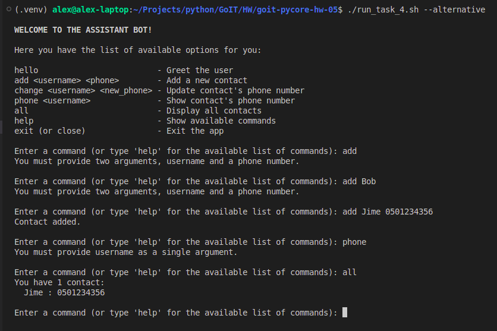

# Python Programming: Foundations and Best Practices 2.0

### [# goit-pycore-hw-06](https://github.com/topics/goit-pycore-hw-06)

<p align="center">
  
</p>


## Basic OOP in Python

<details>

<summary><h3 style="display: inline-block">Project Setup & Run Instructions</h3></summary>

##### Table of Contents
- [Prerequisites](#setup-prerequisites)
- [Setting Up the Development Environment](#setup-setting-up-environment)
  - [Clone the Repository](#setup-clone-repository)
  - [Create a Virtual Environment](#setup-create-virtual-environment)
- [Running the Project](#setup-running-the-project)
  - [Running the Tasks in VS Code](#setup-running-vs-code)
  - [Running the Tasks from the Command Line](#setup-running-command-line)
  - [Running Tasks with Scripts](#setup-running-script)

#### <a name="setup-prerequisites"></a>Prerequisites

Before starting, ensure that you have the following installed:

* [Python 3.7+](https://www.python.org/downloads/) (Make sure python (`python --version` or `python3 --version`) and pip (`python -m pip --version` or `python3 -m pip --version`) are available in your terminal)
* [Git](https://git-scm.com/downloads) (optional, for version control)

#### <a name="setup-setting-up-environment"></a>Setting Up the Development Environment

1. **<a name="setup-clone-repository"></a>Clone (or copy) the Repository**

    If you haven't cloned the project yet, you can do so using:

    ```bash
    git clone https://github.com/oleksandr-romashko/goit-pycore-hw-06.git
    cd goit-pycore-hw-06
    ```

    or download zip archive with code directly [from the repository](https://github.com/oleksandr-romashko/goit-pycore-hw-06/archive/refs/heads/main.zip).

2. **<a name="setup-create-virtual-environment"></a>Create a Virtual Environment**

    * **Linux/macOS (using `bash` or `zsh`):**

      Run the setup.sh script:

      ```bash
      source setup.sh
      ```

      This will:
      * Create a virtual environment (`.venv`).
      * Activate the virtual environment.
      * Install dependencies listed in `requirements.txt`.
      * Set the `PYTHONPATH` for module imports.

    * **Windows (using Command Prompt):**

      If you're using Command Prompt to set up your development environment, you can run the `setup.bat` script:

      ```cmd
      setup.bat
      ```
      This will:
      * Create a virtual environment (.venv).
      * Activate the virtual environment.
      * Install dependencies listed in requirements.txt.
      * Set the `PYTHONPATH` for module imports.


#### <a name="setup-running-the-project"></a>Running the Project

Once your virtual environment is set up, you can run the application code.

* **<a name="setup-running-vs-code"></a>Running the project in VS Code**

  Once the virtual environment is activated and `PYTHONPATH` is set, you can run the project directly from VS Code. Make sure that your `settings.json` (in `.vscode` folder) is correctly set up, as discussed previously.

  VS Code will automatically use the virtual environment and set the correct `PYTHONPATH` if you've configured your settings properly.

  You can launch each task with preconfigured inputs via the debugger ([.vscode/launch.json](.vscode/launch.json)).

  Below is a mapping of launch configurations to their command-line equivalents. You can run them directly or through provided scripts:

* **<a name="setup-running-command-line"></a>Running the project from the Command Line**

  After setting up your virtual environment and setting the `PYTHONPATH`, you can run the project directly from the terminal.

 The command will run the script (please note, that for Linux/macOS you might use `python3` instead of `python` command):

  Command Handler Bot:
  ```bash
  python src/main.py
  or
  python src/main.py --alternative
  ```

* **<a name="setup-running-script"></a>Alternatively, you can use a script to run the project**

  * **On Linux/macOS (shell script)**:

    Run application with the script:
    ```bash
    ./run.sh
    ```

    Make sure the shell scripts have execution permission by running:

    ```bash
    chmod +x ./run.sh
    ```

  * **On Windows (batch script)**:

    ```cmd
    run.bat
    ```

</details>

<details>

<summary><h3 style="display: inline-block; word-break: break-all;">Assignment - Introduce OOP to the Console Assistant Bot</h3></summary>

This task is a follow-up of the previous task **[CLI assistant bot](https://github.com/oleksandr-romashko/goit-pycore-hw-05)**, extended by adding OOP related with data and their processing (how data are stored, what data and what we may do with them).

#### <a name="assignment-task-description"></a>Task description:

Extend [your console assistant bot](https://github.com/oleksandr-romashko/goit-pycore-hw-04/blob/main/README.md#user-content-solution-3) and add error handling using decorators.

#### <a name="assignment-solution"></a>Solution:

Solution for this task is located in the following files:
* [src/task_4/main.py](./src/task_4/main.py) - main entry point file.
* [src/task_4/decorators/input_error.py](./src/task_4/decorators/input_error.py) - decorator to handle input errors
* [src/task_4/handlers/command_handlers.py](./src/task_4/handlers/command_handlers.py) - decorated handling functions

Result screenshot - Task solution (launched in the typical mode (menu handling in match case):


Result screenshot - Task solution (Launched in the alternative mode (Data-Driven Menu):



#### <a name="assignment-task-requirements"></a>Task requirements:

1. All user input errors must be handled by a decorator named `input_error`.
This decorator is responsible for returning helpful messages like:
   * "Enter user name"
   * "Give me name and phone please"
   * etc.
2. The `input_error` decorator should handle exceptions that occur in command `handler` functions, specifically:
   * KeyError
   * ValueError
   * IndexError
  When such an exception occurs, the decorator must return an appropriate error message without terminating the program.

#### <a name="assignment-recommendations-to-the-implementation"></a>Recommendations to the implementation:

As an example, a basic `input_error` decorator that handles `ValueError`:

```python
def input_error(func):
    def inner(*args, **kwargs):
        try:
            return func(*args, **kwargs)
        except ValueError:
            return "Give me name and phone please."

    return inner
```

You can then apply this decorator to your `add_contact` command functions ho handle `ValueError`, like so:

```python
@input_error
def add_contact(args, contacts):
    name, phone = args
    contacts[name] = phone
    return "Contact added."
```

Your task is to:
* Add similar decorators to other command handler functions.
* Extend the decorator to handle other errors with specific messages.

#### <a name="assignment-evaluation-criteria"></a>Evaluation criteria:

1. Implemented an `input_error` decorator that handles user input errors for all commands.
2. Your decorator handles the following exceptions using `input_error`:
  * KeyError
  * ValueError
  * IndexError
3. Each command-handling function is wrapped with the `input_error` decorator.
4. The bot responds properly to various commands, and input errors are gracefully handled without stopping the program.

#### <a name="assignment-usage-example"></a>Usage example according to the Task:

The bot should behave like this when running:

```bash
Enter a command: add
Enter the argument for the command
Enter a command: add Bob
Enter the argument for the command
Enter a command: add Jime 0501234356
Contact added.
Enter a command: phone
Enter the argument for the command
Enter a command: all
Jime: 0501234356
Enter a command:
```

</details>
